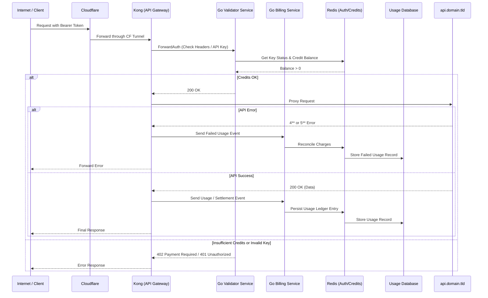
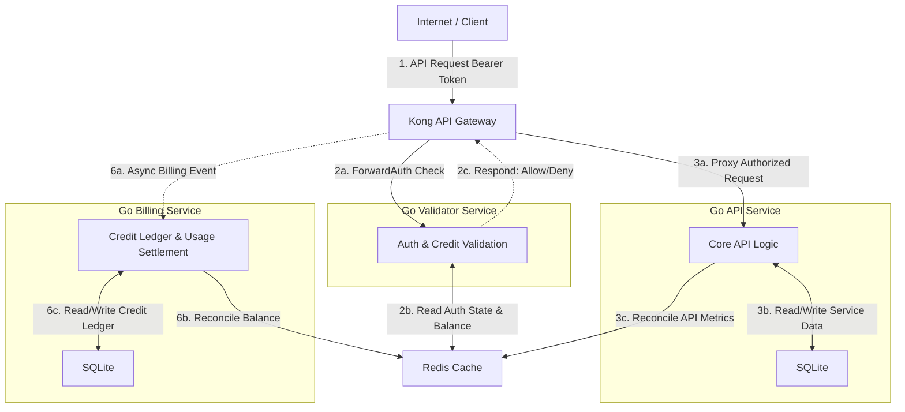

# demo-monetized-api

This is a system design project showing a stripped-down monetized API running on my personal infrastructure. It is composed of Go microservices (API, Validator, and Billing) fronted by Kong as the API Gateway. Redis is used for caching authentication and credit information, with SQLite as persistence on the API service. The system is designed to demonstrate a pay-per-use API model, where consumers are charged credits for each API call based on the complexity of the request.

## System Architecture



## Data Flow

Redis is used as a shared cache across the Validator and Billing services to manage API key states and credit balances in real-time. The API service interacts with a persistent database (SQLite) for application data and also synchronizes credit usage and ledger entries with Redis to ensure consistency across the system. The Billing service processes usage events asynchronously, allowing for eventual consistency in credit deductions while maintaining a responsive API experience.



## Demo Endpoints

Here's a few example commands you can `curl` to test the demo system, it spins up with 100 credits on the demo API key:

Demo API Key: `demo-api-key-123`
Demo API Endpoint: `localhost:8998/api`

### Info

`GET api/v1/info` - Returns basic information about the API and its usage.

```curl
curl -H "Authorization: Bearer demo-api-key-123" http://localhost:8998/api/v1/info
```

```json
{
  "name": "Demo Monetized API",
  "version": "0.0.1",
  "description": "A demo API. See more at https://api.domain.tld/docs"
}
```

### Billing

`GET api/v1/usage/<period>` - Returns a history of API usage and charges. Defaults to `last_24h` if no period is specified.

```curl
curl -H "Authorization: Bearer demo-api-key-123" http://localhost:8998/api/v1/usage/last_24h
```

```json
{
  "timestamp": "2024-06-01T12:00:00Z",
  "credits_used": 5,
  "status": "success",
  "balance": 95,
  "usage_history": [
    {
      "timestamp": "2024-06-01T11:00:00Z",
      "credits_used": 5,
      "status": "success"
    },
    {
      "timestamp": "2024-06-01T10:00:00Z",
      "credits_used": 10,
      "status": "success"
    }
  ]
}
```

### Health

`GET api/v1/health` - Returns the health status of the API.

```curl
curl -H "Authorization: Bearer demo-api-key-123" http://localhost:8998/api/v1/health
```

```json
{
  "status": "healthy",
  "latency_ms": 20,
  "timestamp": "2024-06-01T12:00:00Z",
  "uptime": "72h"
}
```

### Consumables

`POST api/v1/work/<level>` - Performs a unit of work, consuming credits, returns data.

The `<level>` parameter can be `easy`, `medium`, or `hard`, and determines the complexity and credit cost of the work.

```curl
curl -X POST -H "Authorization: Bearer demo-api-key-123" http://localhost:8998/api/v1/work/medium
```

```json
{
    "credits_used": 5,
    "status": "success",
    "timestamp": "2024-06-01T12:00:00Z",
    "duration_ms": 150,
    "result": "Base64-encoded data string"
}
```
