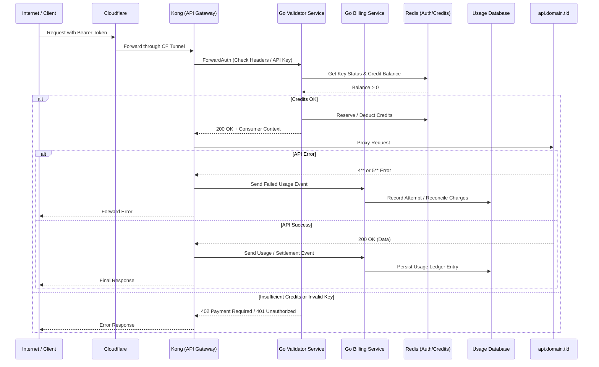

# demo-monetized-api

This is a system design project showing a stripped-down monetized API running on my personal infrastructure. I've mocked up the API using FastAPI and used Go to mock a validator and billing service. This demo spins up a self-contained environment using Docker Compose that stacks Kong as the API Gateway, the two Go services, Redis, and then SQLite (instead of PostgreSQL).



## Demo Endpoints

### Info

`GET api/v1/info` - Returns basic information about the API and its usage.

```curl
curl -H "Authorization: Bearer demo-api-key-123" http://localhost:8998/api/v1/info
```

```json
{
  "name": "Demo Monetized API",
  "version": "0.0.1",
  "description": "A demo API. See more at https://api.domain.tld/docs"
}
```

### Billing

`GET api/v1/usage/<period>` - Returns a history of API usage and charges. Defaults to `last_24h` if no period is specified.

```curl
curl -H "Authorization: Bearer demo-api-key-123" http://localhost:8998/api/v1/usage/last_24h
```

```json
{
  "timestamp": "2024-06-01T12:00:00Z",
  "credits_used": 5,
  "status": "success",
  "balance": 95,
  "usage_history": [
    {
      "timestamp": "2024-06-01T11:00:00Z",
      "credits_used": 5,
      "status": "success"
    },
    {
      "timestamp": "2024-06-01T10:00:00Z",
      "credits_used": 10,
      "status": "success"
    }
  ]
}
```

### Health

`GET api/v1/health` - Returns the health status of the API.

```curl
curl -H "Authorization: Bearer demo-api-key-123" http://localhost:8998/api/v1/health
```

```json
{
  "status": "healthy",
  "latency_ms": 20,
  "timestamp": "2024-06-01T12:00:00Z",
  "uptime": "72h"
}
```

### Consumables

`POST api/v1/work/<level>` - Performs a unit of work, consuming credits, returns data.

The `<level>` parameter can be `easy`, `medium`, or `hard`, and determines the complexity and credit cost of the work.

```curl
curl -X POST -H "Authorization: Bearer demo-api-key-123" http://localhost:8998/api/v1/work/medium
```

```json
{
    "credits_used": 5,
    "status": "success",
    "timestamp": "2024-06-01T12:00:00Z",
    "duration_ms": 150,
    "result": "Base64-encoded data string"
}
```

## Demo Requests

Here's a few example commands you can `curl` to test the system.
The system starts off with 100 credits for the demo API key:

Demo API Key: `demo-api-key-123`
Demo API Endpoint: `localhost:8998/api`

```bash
# Valid request with sufficient credits
curl -H "Authorization: Bearer demo-api-key-123" http://localhost:8998/api/v1/work
```