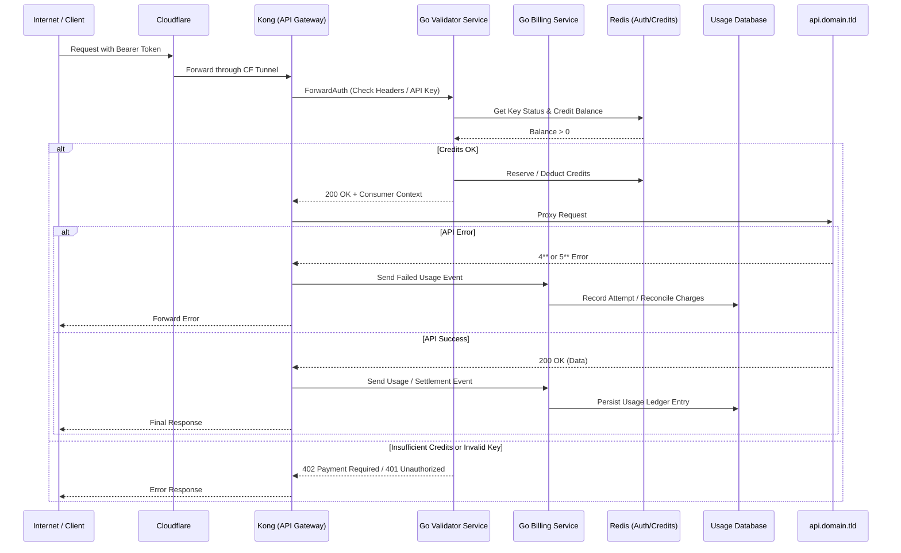

# demo-monetized-api

This is a system design project showing a stripped-down monetized API running on my personal infrastructure. I've mocked up the API using FastAPI and used Go to mock a validator and billing service. This demo spins up a self-contained environment using Docker Compose that stacks Kong as a as API Gateway, the two Go services, Redis, and then SQLite (instead of PostgreSQL).

