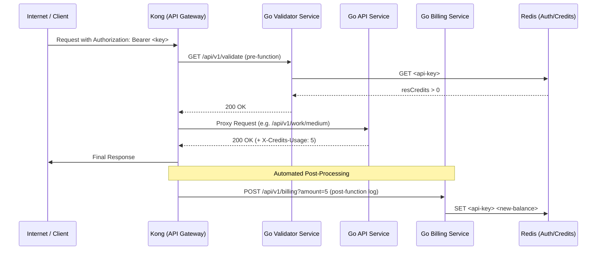
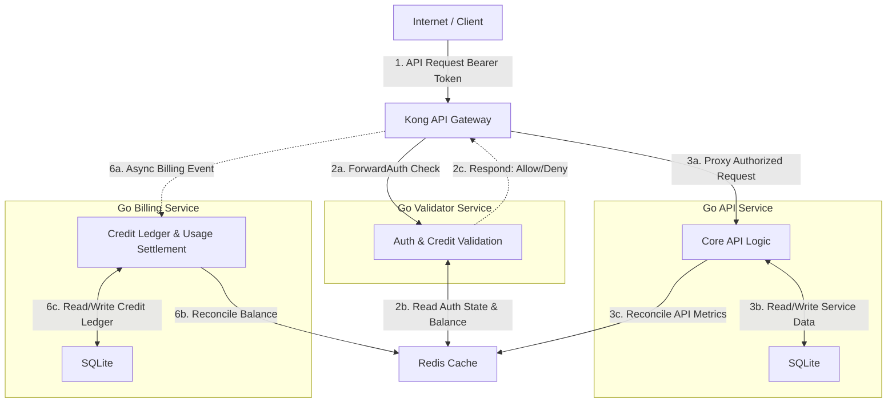

# demo-monetized-api

This is a system design project showing a stripped-down monetized API running on my personal infrastructure. It is composed of Go microservices (API, Validator, and Billing) fronted by Kong as the API Gateway. Redis is used for caching authentication and credit information, with SQLite as persistence on the API service. The system is designed to demonstrate a pay-per-use API model, where consumers are charged credits for each API call based on the complexity of the request.

## System Architecture


```mermaid
sequenceDiagram
    participant User as Internet / Client
    participant Kong as Kong (API Gateway)
    participant Validator as Go Validator Service
    participant API as Go API Service
    participant Billing as Go Billing Service
    participant Redis as Redis (Auth/Credits)

    User->>Kong: Request with Authorization: Bearer <key>
    
    Kong->>Validator: GET /api/v1/validate (pre-function)
    Validator->>Redis: GET <api-key>
    Redis-->>Validator: resCredits > 0
    Validator-->>Kong: 200 OK

    Kong->>API: Proxy Request (e.g. /api/v1/work/medium)
    API-->>Kong: 200 OK (+ X-Credits-Usage: 5)
    
    Kong->>User: Final Response
    
    Note over Kong,Billing: Automated Post-Processing
    Kong->>Billing: POST /api/v1/billing?amount=5 (post-function log)
    Billing->>Redis: SET <api-key> <new-balance>
```

## Data Flow

Redis is used as a shared cache across the Validator and Billing services to manage API key states and credit balances in real-time. The API service interacts with a persistent database (SQLite) for application data and also synchronizes credit usage and ledger entries with Redis to ensure consistency across the system. The Billing service processes usage events asynchronously, allowing for eventual consistency in credit deductions while maintaining a responsive API experience.


```mermaid
graph TD
    User[Internet / Client]
    Kong[Kong API Gateway]
    Redis[Redis Cache]
    
    subgraph "Go API Service"
        APILogic[Core API Logic]
        APIDB[SQLite]
    end

    subgraph "Go Validator Service"
        AuthLogic[Auth & Credit Validation]
    end

    subgraph "Go Billing Service"
        BillingLogic[Credit Ledger & Usage Settlement]
        BillingDB[SQLite]
    end

    User -->|1. API Request Bearer Token | Kong
    Kong -->|2a. ForwardAuth Check| AuthLogic
    AuthLogic <-->|2b. Read Auth State & Balance| Redis
    AuthLogic -.->|2c. Respond: Allow/Deny| Kong

    Kong -->|3a. Proxy Authorized Request| APILogic
    APILogic <-->|3b. Read/Write Service Data| APIDB
    APILogic -->|3c. Reconcile API Metrics| Redis

    Kong -.->|6a. Async Billing Event| BillingLogic
    BillingLogic -->|6b. Reconcile Balance| Redis
    BillingLogic <-->|6c. Read/Write Credit Ledger| BillingDB
```

## Starting the Demo

1. Clone the repository and navigate to the project root.
    ```bash
    git clone https://github.com/m-spangneberg/demo-monetized-api.git
    cd demo-monetized-api
    ```
2. Spin up the entire stack:
   ```bash
   docker compose up --build
   ```
3. The services will be available at:
   - **Kong Gateway**: http://localhost:8000
   - **Go API**: http://localhost:8082
   - **Go Billing**: http://localhost:8081
   - **Go Validator**: http://localhost:8080

## Demo Endpoints

You can test the monetization flow using the following `curl` commands.

```bash
# Check initial info (should show 100.00 credits)
curl -H "Authorization: Bearer demo-api-key-123" http://localhost:8000/api/v1/info
# {
#   "balance":100,
#   "description":"A demo API. See more at https://api.domain.tld/docs",
#   "name":"Demo Monetized API",
#   "version":"0.0.1"
# }

# Perform work (deducts 5 credits asynchronously)
curl -X POST -H "Authorization: Bearer demo-api-key-123" http://localhost:8000/api/v1/work/medium
# {
#   "balance":95,
#   "credits_used":5,
#   "duration_ms":280,
#   "result":"Base64-encoded data string representing medium work",
#   "status":"success",
#   "timestamp":"2026-05-07T19:28:25Z"
# }

# Check health (should show updated balance)
curl -H "Authorization: Bearer demo-api-key-123" http://localhost:8000/api/v1/health
# {
#   "balance":95,
#   "latency_ms":107,
#   "status":"healthy",
#   "timestamp":"2026-05-07T19:25:10Z",
#   "uptime":"72h"
# }
```
